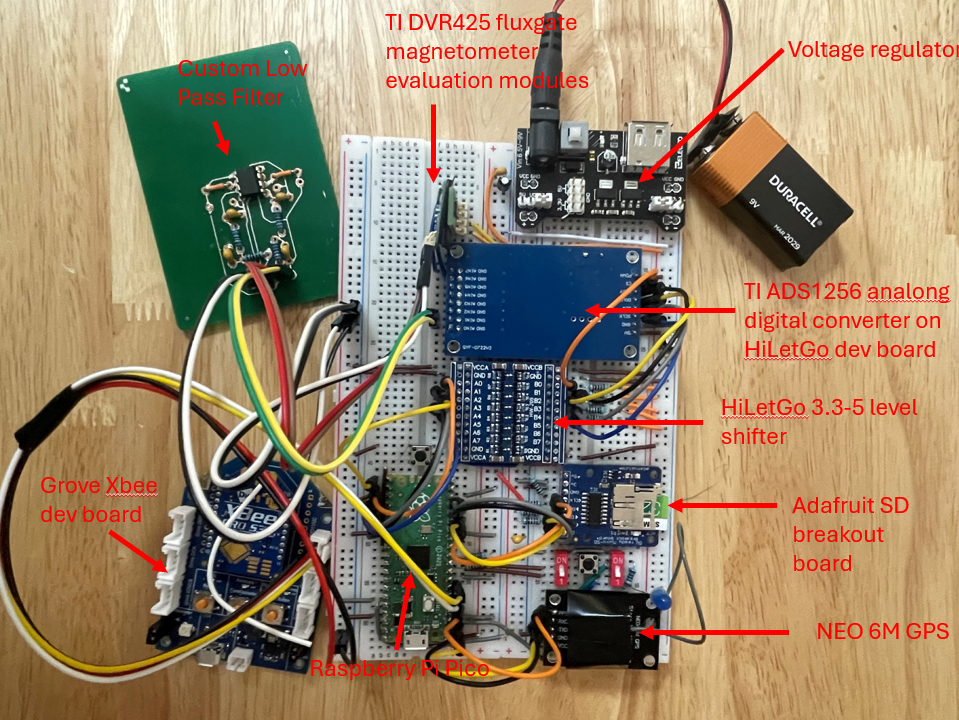

# pi-pico-mag
Instrument prototyping to monitor electromagnetic  noise induced by power lines

This is a data aquisistion system intended to record the magnetic field induced by overhead or burried electric transmission lines. Basically an indirect current monitor or ampmeter.

## Disclaimer

There are still several issues to work out. The write to SD card protocol causes unwanted delays at random times during data sampling. The communication protocol using Xbee is not complete but I intend to use the radio to communicate with other aquisition systems in am manner that they share with eachother the times they intend to record data and syncronize. Command sequence with the ADS could likely be improved to both increase speed and accuracy. The low pass filter designed is for practice and demonstration only. In later versions i intend to use pre-build filter chips for anti-aliasing.

## Usage

### setting up the device and pico
The circuit can be built by following the circuit diagrams found in this repository. The pi pico needs to be flashed using the bootsell button on the pico and the flahs file found in this repo prior to uploading any code. Flahs file can of course be found online, it is the standard flash file for micropython pico.

### Test and Debug
Debugging the sensor and analog digital conversion is easiest when using a live reading. The notebook (read_sensor_live.ipynb) can be used as a serial monitor. You have to set the com port, and the components. This will read data if the pico has all of the following files:
- operate/helpers.py
- operate.sdcard.py
- tests/print_ADS/main.py

To test the GPS the pico should have the following files uploaded:
- operate/helpers.py
- operate.sdcard.py
- tests/print_GPS/main.py 
Monitor text through a serial monitor. Once the GPS has a valid signal it will print information. Verify accuracy

To test the sd card operations follow similar procedure as testing the GPS but with the file:
- tests/sd_file_io/main.py
The sd card must be formatted in FAT32. If it does not operate as expected check formatting on a pc then reinsert into device. 

the driver file for the sdcard breakout board via spi was found on a forum and is accessible via this link
https://github.com/micropython/micropython/files/13183364/sdcard.py.zip, and i was unable to recover the name of the author who created thisversion of the driver. Note this one works far better than the one on the official micropython-lib main branch

### Operate as a data aquisition tool
The sampling rate can be set in the operate/main.py file. Select desired sampling rate from the list found in operate/helpers.py. Those are the only options the ADS recognizes. This is a target rate, due to the fileio speed in the sd card and limited memory on the pico, the desired sampling rate will likely not be achieved if over 1000Hz. The size of the files can also be set. this is the number of samplies recorded continously before closing the file. The file naming convention can also be modified in main.py
The pico must have the following files uploaded:
- operate/helpers.py
- operate.sdcard.py
- operate/main.py

To ensure proper operation the device can be connected to a serial monitor. Inspect the text during initialization to ensure all parts are operating. Proper operation when not using gps for time syncronization should look like this:

Initializing ADS1256
Data rate set to 15000 SPS (DRATE value: 0xe0)
Current Data Rate Register Value: 0xe0
DRDY = 0
not using gps
Initializing SD board
SD card mounted.
measuring 1 component 30000 samples
New file created: /sd/30_nogps_x_1.bin
measuring 1 component 30000 samples
New file created: /sd/16_nogps_x_2.bin
Program terminated by stop.
SD card unmounted successfully.
end

There are 2 switches and 2 buttons in the design. 
- One switch enables the GPS. if using outdoors you can enable it and the sampling will automatically check the PPS signal and save a flag in the recorded times most significant bit when the pps goes hot. If using indoors, deisable gps otherwise the sensor will just wait for a valid gps signal before starting data aquisition.
- The other switch toggles between 1 and 2 component magnetic field measnurment. The device struggles to keep up with sampling rates over 500Hz in 2 component mode. This is becuase a command is sent to the ADS between each measnurment to switch to different MUX inputs. The switching takes time.
- A button between hte two switches is for stopping data aquisition. This should be used before powering down the instrument to allow the sd card to be unmounted.
- A button near the pico can be used to restart the entire initialization then data aquisition. When not connected to a pc for serial monitoring. you can interpret the lights on the board as indicators that the process is running correctly. If a light does not flicker on the sd card's board. This indicates that data is not being recorded. Restart with the button. When using gps, the blue LED should pulse every second. If gps is enabled and this is not occuring, restart with the button.

Files are saved in binary format with some basic metadata saved in plain text at the beginning of each file. The binary format for one samplie is:
- Pack data: [raw_data (3 bytes), combined_time (4 bytes)] for single component measurement
- Pack data: [raw_data_x (3 bytes), combined_time_x (4 bytes), raw_data_y (3 bytes), combined_time_y (4 bytes)] 
And the syncronization pulese is savd in the most significant bit in the combined_time or combine_time_x.

Basic file read and plotting can be done with the notebook (read_sensor_files.ipynb). Because the 2 component measurment is still onot optimized and likely requires an additional ADS for high rate sampling, the notebook currently only reads 3SI formated files which are the sinlge component files. Small modification can be made to read the 2 component files, however this is a work in progress.

